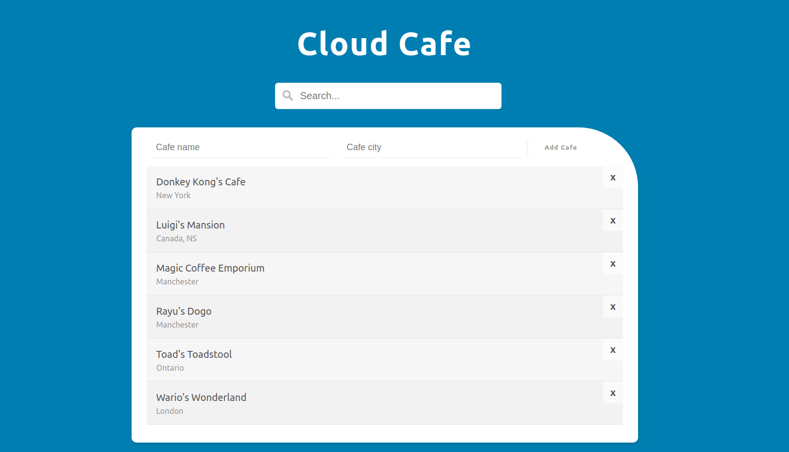

# Before Run **Cloud Cafe** Configure the Following

- Create a `config.js` file inside your project root directory.
- Add following JavaScript object into the file replacing your Firebase firestore configuration object with API key,
    database URL etc.
- Object as follows.

```js
var firebaseConfig = {
    apiKey: '<YOUR_API_KEY>',
    authDomain: '<YOUR_AUTH_DOMAIN>',
    databaseURL: 'YOUR_DB_URL',
    projectId: '<YOUR_PROJECT_ID>',
    storageBucket: '<YOUR_BUCKET>',
    messagingSenderId: '<YOUR_SENDER_ID>',
    appId: '<YOUR_APP_ID>',
    measurementId: '<YOUR_MEASURE_ID>',
};
```

# How to run the application

- Just run the `index.html` by opening it.
- You will see the application as below.


